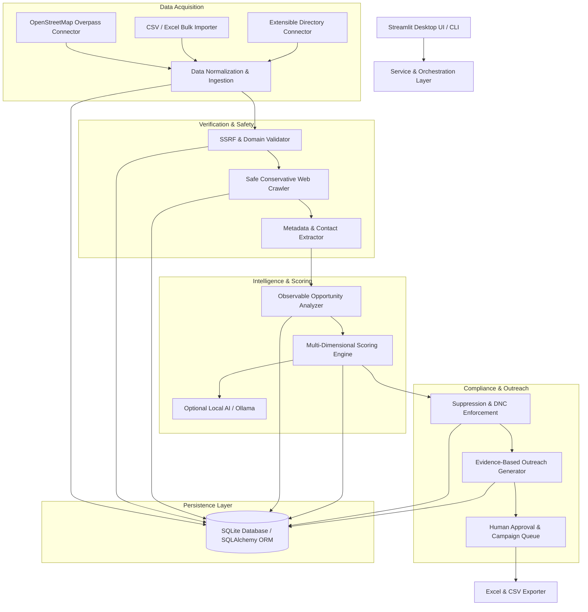

# XENITH Lead Generator — System Architecture

## 1. High-Level Architecture Overview

The system is designed as a modular, local-first Python application. It operates without cloud lock-in, external mandatory APIs, or complex distributed dependencies.



---

## 2. Directory Structure

```
Lead_Genrator/
├── core/                        # Foundation utilities & system settings
│   ├── __init__.py
│   ├── config.py                # Environment & application configuration
│   ├── security.py              # SSRF protection, IP filtering, safe URLs
│   ├── logging.py               # Structured logging system
│   ├── errors.py                # Custom domain exceptions
│   └── ai_client.py             # Optional local Ollama / LLM interface
├── database/                    # Persistence layer
│   ├── __init__.py
│   ├── connection.py            # SQLite engine & session management
│   ├── models.py                # SQLAlchemy ORM schemas
│   ├── repository.py            # Data access & queries
│   └── deduplication.py         # Multi-factor entity matching
├── connectors/                  # Data discovery integrations
│   ├── __init__.py
│   ├── base.py                  # Abstract connector interface
│   ├── osm_connector.py         # OpenStreetMap Overpass client
│   ├── file_importer.py         # CSV & Excel validator & parser
│   └── directory_connector.py   # Registry / directory connector
├── analyzer/                    # Verification & website inspection
│   ├── __init__.py
│   ├── crawler.py               # Safe rate-limited crawler
│   ├── robots_checker.py        # robots.txt validator
│   ├── contact_extractor.py     # Public business contact extractor
│   └── opportunity_analyzer.py  # Observable tech opportunity checks
├── scoring/                     # Lead qualification & ranking
│   ├── __init__.py
│   ├── engine.py                # 5-dimensional scoring model
│   └── weights.py               # Configurable scoring profiles
├── outreach/                    # Drafting & messaging
│   ├── __init__.py
│   ├── templates.py             # Service-specific outreach copy
│   └── generator.py             # Evidence-injected personalized drafts
├── compliance/                  # Privacy & suppression controls
│   ├── __init__.py
│   ├── suppression.py           # Global DNC matching
│   └── policies.py              # Regional market regulations & warnings
├── ui/                          # Streamlit user interface
│   ├── __init__.py
│   ├── app.py                   # Main entry point & routing
│   ├── state.py                 # Session state management
│   ├── styles.py                # XENITH branded styling & CSS
│   └── views/                   # 13 dedicated sub-views
│       ├── overview.py
│       ├── discovery.py
│       ├── import_view.py
│       ├── database_view.py
│       ├── analyzer_view.py
│       ├── scoring_view.py
│       ├── lead_detail.py
│       ├── outreach_view.py
│       ├── campaigns.py
│       ├── suppression_view.py
│       ├── data_sources.py
│       ├── export_view.py
│       └── settings_view.py
├── tests/                       # Comprehensive test suite
│   ├── conftest.py
│   ├── test_security.py
│   ├── test_deduplication.py
│   ├── test_crawler.py
│   ├── test_analyzer.py
│   ├── test_scoring.py
│   ├── test_suppression.py
│   ├── test_importer.py
│   └── test_outreach.py
├── docs/                        # Project documentation
├── requirements.txt             # Frozen dependencies
├── run.bat                      # Windows one-click launcher
└── README.md                    # Setup & operational manual
```

---

## 3. Component Details & Design Decisions

### 3.1 Persistence & Data Model
- **SQLite Engine:** Fast, zero-maintenance, fully embedded, single-file database (`data/xenith_leads.db`).
- **SQLAlchemy ORM:** Provides type safety, relationship mapping, and portable queries.
- **Transactional Integrity:** Write operations executed inside session context managers with automatic rollback on error.

### 3.2 Security & SSRF Prevention
- Strict validation before requesting any external URL:
  - Protocol must be `http` or `https`.
  - DNS resolution checked prior to connection.
  - Prohibits IPv4 loopback (`127.0.0.0/8`), private networks (`10.0.0.0/8`, `172.16.0.0/12`, `192.168.0.0/16`), link-local (`169.254.0.0/16`), and multicast.
  - Prohibits IPv6 loopback (`::1`) and unique-local addresses.
  - Redirect handling validates target URL before following.
  - Maximum content length enforced (default: 2 MB) to prevent denial of service.

### 3.3 Deduplication Strategy
- Normalized Domain Matching (strips `www.`, protocols, trailing slashes).
- Normalized Company Name (strips punctuation, common suffixes such as `LLC`, `Inc`, `Corp`, `Pty Ltd`, `FZE`, `FZCO`).
- City + Phone Exact Matching.
- Conflict Resolution: When new evidence arrives for an existing entity, updates are recorded with full provenance rather than blindly overwriting historic data.

### 3.4 Lead Qualification & Scoring Formula
Total Score (0–100) =
1. **Business Legitimacy (0–20):** Valid operational company, verified domain, responsive HTTP, consistent name and category.
2. **Relevance to XENITH Services (0–20):** Fits target verticals (professional services, healthcare, trade, tech, hospitality, B2B agencies).
3. **Observable Opportunity (0–25):** Observable gap in web presence (no mobile optimization, outdated design, missing online booking, absence of self-service/chatbot, manual forms).
4. **Business Contact Channel Availability (0–15):** Explicit public business email, official phone, or verified contact form.
5. **Evidence Quality & Recency (0–20):** Freshness of crawl, unambiguous signals, multiple corroborated indicators.

### 3.5 Compliance & Suppression
- Entities in the `SuppressionRecord` table are checked across domain, phone, email, and company name before outreach draft generation or data export.
- Human review is strictly required before exporting outreach material.
